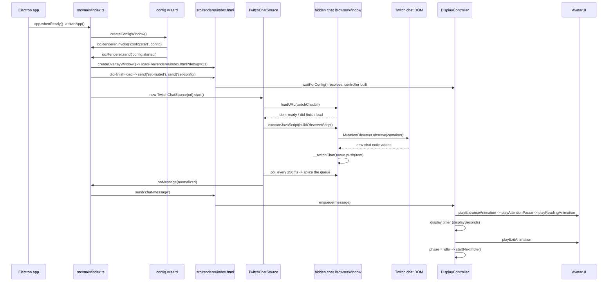

# First Message Flow (Overlay)

Traces the exact code path for the first chat bubble that becomes visible, from app boot to the
bubble hiding again.

Every path below is a real file in this repository. If a rename makes one of them wrong, this
document is wrong — fix it in the same commit.

## Mermaid sequence diagram



## Timeline

1. **T0** — `app.whenReady().then(startApp)` in `src/main/index.ts`. IPC handlers are registered
   before that, at module load, by `setupConfigIPC()`.
2. **T1** — `startApp()` always opens the **configuration wizard** first
   (`src/main/configWindow.ts`). The overlay does not exist yet.
3. **T2** — The wizard (`src/renderer/config/scripts/configApp.ts`) loads the schema and the merged
   config over IPC, renders the form, and validates it. **Start** stays disabled until the config
   is valid.
4. **T3** — Clicking **Start** calls `config:start`, which validates and persists the diff from
   defaults, then `config:started`, which closes the wizard and calls back into
   `createOverlayWindow(config)`.
5. **T4** — `createOverlayWindow()` picks the monitor with
   `resolveTargetDisplay()` (`src/shared/displays.ts`) and creates the transparent, click-through,
   always-on-top `BrowserWindow` with `src/preload/index.ts` attached.
6. **T5** — On `did-finish-load` the main process sends **`set-muted`** (the tray's mute state
   survives overlay restarts) and then **`set-config`**. The preload resolves any pending
   `waitForConfig()`; if nothing arrives within 2 s it falls back to `parseEnvConfig()`.
7. **T6** — The inline bootstrap in `src/renderer/index.html` awaits `waitForConfig()` and builds
   `NotificationSound`, `AvatarUI` and `DisplayController`, wiring the display callbacks.
8. **T7** — In parallel, `TwitchChatSource.start()` (`src/main/chatSource.ts`) opens a **hidden**
   `BrowserWindow` (`sandbox: true`, `contextIsolation: true`), loads the popout URL and starts a
   250 ms poller.
9. **T8** — On `dom-ready` or `did-finish-load`, `attachObserverWithRetry()` injects the observer
   script with exponential backoff (250 ms → 2 s) until a chat container matches or 10 s elapse.
10. **T9** — The injected script marks every message node already on the page as seen, then attaches
    a `MutationObserver`. Backlog messages are therefore never displayed.
11. **T10** — The first new node appears. The script extracts `id`, `user`, `text` and `timestamp`
    and pushes an item onto `window.__twitchChatQueue`.
12. **T11** — The next poll tick splices the queue, `normalizeMessage()` trims and guarantees an id,
    the bounded `seenIds` cache rejects duplicates, and `onMessage` forwards it.
13. **T12** — The main process sends `chat-message` over IPC; the overlay calls
    `controller.enqueue(message)`.
14. **T13** — `enqueue()` deduplicates, applies the ignore list and command prefix, truncates, and
    pushes onto the queue (dropping the oldest past `maxQueueLength`). With the controller idle,
    `startNextIfIdle()` runs immediately.
15. **T14** — `runDisplaySequence()` plays the four stages in order, then the display timer, then
    the exit animation, and returns to `'idle'`. Any failure in a stage is caught, logged as
    `DISPLAY_FAILED`, and the controller returns to `'idle'` so the next message still displays.

## Configuration precedence

`src/config/merge.ts` resolves, in order: **schema defaults → saved config → environment variables
→ CLI overrides**, tracking the source of each field so the wizard can show an `ENV`/`CLI` badge. An
environment value that cannot be parsed to the field's type is ignored rather than applied.

The overlay receives the resolved values over `set-config`. `parseEnvConfig()` in the preload is
only a fallback for the case where the main process never sends one.

## Chat connection and observation

Twitch chat is loaded in a hidden `BrowserWindow` — not a `webview` or an iframe. The observer is
injected with `webContents.executeJavaScript()` and attaches to the first container that matches:

- **Container**: `[data-test-selector="chat-scrollable-area__message-container"]`,
  `[data-a-target="chat-scrollable-area__message-container"]`, `[role="log"]`,
  `.chat-scrollable-area__message-container`
- **Message**: `[data-a-target="chat-line-message"]`, `[data-test-selector="chat-line-message"]`,
  `[data-a-target="chat-message"]`, `.chat-line__message`
- **Username**: `[data-a-target="chat-message-username"]`,
  `[data-test-selector="chat-message-username"]`, `.chat-author__display-name`
- **Text**: `[data-a-target="chat-message-text"]`, `[data-test-selector="chat-message-text"]`,
  `.chat-line__message-body`, then a `.text-fragment` fallback
- **Ignored (system notices)**: `[data-a-target="user-notice-line"]`,
  `[data-a-target="chat-deleted-message"]`, `[data-a-target="chat-line-delete-message"]`,
  `.chat-line__status`
- **Timestamp**: `time`, `[data-a-target="chat-timestamp"]`

No messages appear when: the URL is empty or not a `twitch.tv` host (suffix match — a lookalike host
is rejected), the hidden window fails to load, or no container matches within 10 seconds.

## Message normalization

In the injected script, `user` and `text` are required; `id` and `timestamp` are optional, and every
item also carries `capturedAt`.

`TwitchChatSource.normalizeMessage()` then trims, rejects empty values and guarantees both fields:

- `timestamp`: parsed DOM timestamp → `capturedAt` → `Date.now()`
- `id`: DOM id → generated `local-<counter>-<timestamp>-<hash>`

The message that reaches the renderer has exactly `id`, `user`, `text`, `timestamp`. There is no
avatar image in it — the avatar is a styled DOM element.

## Deduplication (three layers)

| Layer | Where | Bounded by |
|---|---|---|
| `WeakSet` of DOM nodes | injected script | garbage collection, as Twitch prunes its DOM |
| `seenIds` | `TwitchChatSource` | `BoundedIdSet`, 2000 ids |
| `seenIds` | `DisplayController` | `BoundedIdSet`, 500 ids |

The two id caches evict oldest-first (`src/shared/boundedIdSet.ts`), so a multi-hour stream does not
grow them without limit.

## Timing and teardown

`displaySeconds` becomes `displayMs` in the controller. The timers involved in one message are:

- `setInterval(…, 250)` in `TwitchChatSource.startPolling()`
- `setTimeout(displayMs)` in `waitDisplayDuration()`
- `setTimeout(exitAnimationMs)` in `waitExitDuration()`, only when no `playExitAnimation` callback
  is supplied

Each sequence carries a **token**. When a new sequence starts, the token changes, timers are
cleared and `onDisplay.cancel()` resets the avatar — so a superseded sequence can never write state
belonging to the current one.

## Edge cases for the first message

- Backlog messages present at attach time are marked as seen and never displayed.
- A message missing a username or text is dropped inside the observer script.
- A message from an ignored user, or starting with `IGNORE_COMMAND_PREFIX`, leaves the overlay empty
  until a non-ignored message arrives.
- The first message can be delayed by up to the 250 ms poll interval, and `flushQueue()`
  short-circuits entirely while `webContents.isLoading()` is true.
- If the display sequence throws, the message is lost but the overlay stays alive.

## How to debug

```bash
TWITCH_CHAT_URL="https://www.twitch.tv/popout/<channel>/chat" DIAGNOSTICS=1 npm run start:diag
```

- `OVERLAY_DEBUG=1` adds the debug frame and live counters (received, displayed, dropped, ignored,
  truncated) to the overlay.
- `DEVTOOLS=1` opens DevTools for the overlay window in development.
- Main-process `[diagnostics]` lines come from `src/main/index.ts` and `src/main/chatSource.ts`:
  observer attachment, parsed messages, and the resolved monitor.
- Renderer `[diagnostics]` lines come from `src/renderer/scripts/displayController.ts` and
  `avatarAnimator.ts` — see [AVATAR_QA.md](AVATAR_QA.md) for the full list.
- Chat text is logged **only** when diagnostics or overlay debug are enabled.

## Key code locations

| Concern | File |
|---|---|
| App lifecycle, overlay window, system tray | `src/main/index.ts` |
| Configuration wizard window | `src/main/configWindow.ts` |
| IPC handlers | `src/main/ipcHandlers.ts` |
| Hidden chat window, observer, polling, normalization | `src/main/chatSource.ts` |
| Monitor resolution | `src/shared/displays.ts` |
| Overlay IPC bridge | `src/preload/index.ts` |
| Overlay bootstrap | `src/renderer/index.html` |
| Queueing, filtering, display sequencing | `src/renderer/scripts/displayController.ts` |
| Bubble and avatar DOM | `src/renderer/scripts/avatarUI.ts` |
| GSAP animation | `src/renderer/scripts/avatarAnimator.ts` |
| Notification sound | `src/renderer/scripts/notificationSound.ts` |
| Visual transitions | `src/renderer/styles/avatarUI.css` |
